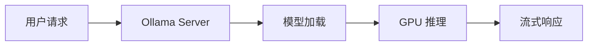
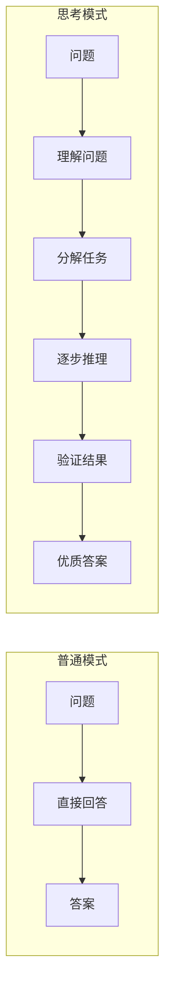
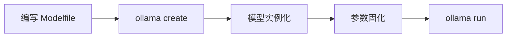
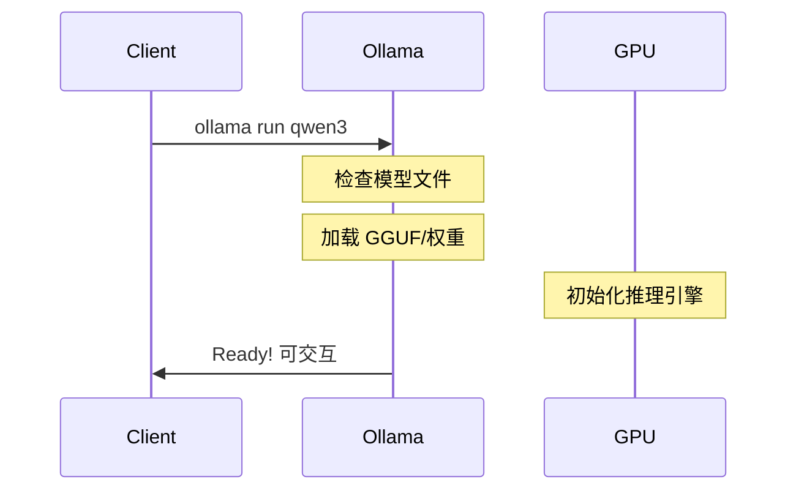
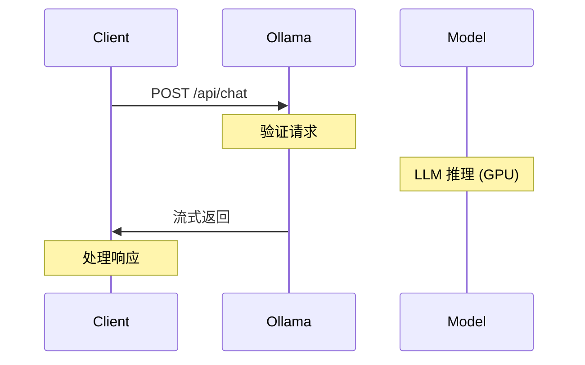
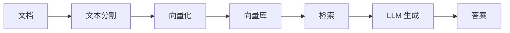
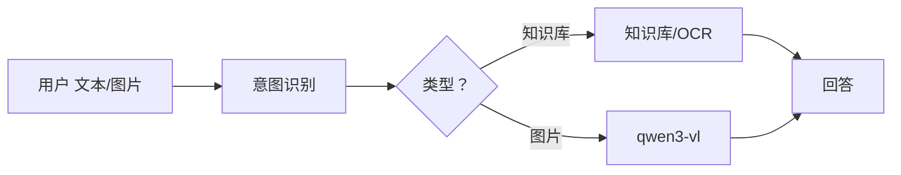

# 本地大模型完全指南：Ollama 从入门到精通

> 在本地运行大语言模型从未如此简单！本文带你全面了解 Ollama 的安装、模型管理、API 开发和实战应用，让你的 AI 应用跑在本地！

---

## 目录

1. [什么是 Ollama？](#什么是-ollama)
2. [Ollama 工作流程与思考模式](#ollama-工作流程与思考模式)
3. [硬件配置完全指南](#硬件配置完全指南)
4. [全平台安装教程](#全平台安装教程)
5. [模型管理：从下载到自定义](#模型管理从下载到自定义)
6. [API 开发与 SDK 集成](#api-开发与-sdk-集成)
7. [五大实战案例](#五大实战案例)
8. [性能优化技巧](#性能优化技巧)

---

## 什么是 Ollama？

Ollama 是一个开源的大语言模型运行平台，让开发者能够在本地轻松部署和运行各种大语言模型。它提供了简洁的命令行工具和完整的 REST API，支持多种主流模型，包括 Qwen、Llama、GLM、Nemotron 等。

### 核心优势

- **本地部署**：数据完全本地化，保护隐私
- **开箱即用**：一条命令即可运行大模型
- **多模型支持**：支持数十种主流开源模型
- **API 友好**：提供完整的 REST API 和多种语言 SDK
- **GPU 加速**：自动利用 NVIDIA CUDA、Apple Metal 等硬件加速
- **轻量高效**：采用 GGUF 量化格式，大幅降低内存占用

---

## Ollama 工作流程与思考模式

### Ollama 工作流程



当用户发起请求时，Ollama Server 会接收请求，加载相应的模型到内存或显存中，然后通过 GPU 进行推理计算，最后以流式的方式返回结果。这种设计使得首次请求可能稍慢（需要加载模型），但后续请求会非常快，因为模型会缓存在内存中。

### 什么是思考模式（Thinking Mode）？

思考模式是新一代大语言模型的高级特性，让模型能够**分步推理**、**自我纠错**、**深度思考**复杂问题，而非直接给出答案。

#### 为什么要引入思考模式？

1. **复杂问题处理**：数学证明、逻辑推理需要多步思考
2. **自我纠错能力**：模型可以回顾并修正错误
3. **可解释性增强**：展示推理过程，增加可信度
4. **答案质量提升**：思考后再回答，准确率显著提升

### 思考模式 vs 普通模式对比



普通模式下，模型接收问题后直接生成答案；而思考模式会让模型先理解问题、分解任务、逐步推理、验证结果，最终给出更优质的答案。虽然耗时更长，但对于复杂问题的解决能力显著提升。

---

## 硬件配置完全指南

### 消费级 GPU 配置推荐

| GPU 型号 | 显存 | 推荐运行模型 |
|---------|------|-------------|
| RTX 4060 Ti | 8GB | qwen3:8b, phi3, lfm2.5 |
| RTX 4070 | 12GB | qwen3:14b, qwen3:32b |
| RTX 4080 | 16GB | qwen3:72b, nemotron-nano |
| RTX 4090 | 24GB | qwen3:72b (Q4), glm-5 |
| RTX 3090/4090 | 24GB x2 | 多模型并行，大模型 |

### 专业级 GPU 配置推荐

| GPU 型号 | 显存 | 推荐运行模型 |
|---------|------|-------------|
| A100 40GB | 40GB | qwen3:72b, nemotron |
| A100 80GB | 80GB | qwen3:235b, 多模型 |
| A6000 | 48GB | qwen3:72b, 大模型 |
| H100 80GB | 80GB | 最大模型，高速推理 |
| 多卡集群 | 多卡 | 企业级部署 |

### 内存与存储要求

| 组件 | 最低要求 | 推荐配置 |
|------|---------|---------|
| 系统内存 | 16GB | 32GB+ |
| 模型存储 | 50GB | 200GB+ (SSD) |
| 推荐存储 | NVMe SSD | PCIe 4.0/5.0 |

### Mac 配置推荐

| 芯片 | 统一内存 | 推荐运行模型 |
|------|---------|-------------|
| M1 Pro | 16GB | qwen3:8b, phi3 |
| M1 Max | 32GB | qwen3:14b |
| M2 Max | 64GB | qwen3:32b |
| M3 Max | 64-128GB | qwen3:72b |

### 场景化硬件方案

#### 🏠 个人开发者
- **配置**：RTX 4070 (12GB) + 32GB RAM
- **预算**：¥5000-7000
- **可运行**：qwen3:14b-32b

#### 🏢 小团队
- **配置**：RTX 4090 (24GB) + 64GB RAM
- **预算**：¥15000-20000
- **可运行**：qwen3:72b, 多模型

#### 🏭 企业部署
- **配置**：A100/H100 80GB x 多卡
- **预算**：¥200000+
- **可运行**：任意大模型，并行服务

#### 📱 Mac 用户
- **配置**：M3 Max 64GB+ 统一内存
- **预算**：¥25000+
- **可运行**：qwen3:32b-72b

### 硬件加速状态检查

```bash
# 检查 Ollama GPU 支持
ollama list

# 查看 GPU 是否工作 (Linux)
nvidia-smi

# macOS Metal 加速 (自动启用)
# 无需额外配置

# Windows WSL2 + CUDA
# 确保安装 NVIDIA 驱动
```

---

## 全平台安装教程

### macOS 安装

推荐使用 Homebrew 安装：

```bash
brew install ollama
```

安装完成后自动启动服务，监听 11434 端口。

### Linux 安装

#### 方式一：curl 安装脚本（推荐）

```bash
curl -fsSL https://ollama.com/install.sh | sh
```

#### 方式二：手动下载

```bash
wget https://ollama.com/download/ollama-linux-amd64
sudo mv ollama-linux-amd64 /usr/local/bin/ollama
sudo chmod +x /usr/local/bin/ollama
```

### Windows 安装

- **方式一**：从 Microsoft Store 搜索 "Ollama" 安装
- **方式二**：下载安装包 `ollama-windows-amd64.exe` 运行

### 验证安装

```bash
# 查看版本
ollama --version

# 查看服务状态
ollama list

# 启动服务（如未自动启动）
ollama serve
```

### 国内加速访问

#### 环境变量配置

```bash
# 设置代理加速下载
export HTTP_PROXY=http://127.0.0.1:7890
export HTTPS_PROXY=http://127.0.0.1:7890

# 或使用国内镜像（如果可用）
export OLLAMA_MODEL=/path/to/models
```

#### 国内镜像站点

| 类型 | 地址 | 说明 |
|------|------|------|
| 模型镜像 | https://model.ollama.ac.cn | 国内模型镜像 |
| API 镜像 | https://api.ollama.cn | 国内 API 镜像 |
| 社区镜像 | https://gpt.ovofly.com | 社区维护 |

#### 快速配置脚本

```bash
# 国内一键配置（使用镜像源）
curl -fsSL https://ollama.cn/install.sh | sh

# 或手动设置环境变量
echo 'export OLLAMA_HOST="0.0.0.0:11434"' >> ~/.bashrc
echo 'export OLLAMA_MODELS="/path/to/fast/disk"' >> ~/.bashrc
source ~/.bashrc
```

### Ollama 服务架构


---

## 模型管理：从下载到自定义

### 热门模型下载

#### Qwen3 系列（阿里）

```bash
ollama pull qwen3           # 基础版
ollama pull qwen3:8b        # 8B 参数
ollama pull qwen3:32b       # 32B 参数
ollama pull qwen3-vl        # 视觉理解
ollama pull qwen3-coder-next # 代码专用
ollama pull qwen3-embedding # 向量嵌入
```

#### NVIDIA Nemotron

```bash
ollama pull nemotron-super  # 120B MoE
ollama pull nemotron-nano   # 30B 轻量
```

#### 智谱 GLM 系列

```bash
ollama pull glm-4.7-flash   # 快速推理
ollama pull glm-5           # 40B 强推理
ollama pull glm-ocr         # OCR 识别
```

#### 月之暗面 Kimi

```bash
ollama pull kimi-k2.5       # 多模态代理
```

#### MiniMax

```bash
ollama pull minimax-m2.5    # 中文优化
```

#### Mistral AI

```bash
ollama pull ministral-3     # 3B-14B
ollama pull lfm2            # 24B MoE
ollama pull lfm2.5-thinking # 思考模式
```

### 主流模型对比

| 模型 | 参数量 | 下载量 | 特点 | 推荐配置 |
|------|--------|--------|------|---------|
| QWEN3-VL | 2B - 235B | 2.1M | 视觉 + 推理 | ≥8GB VRAM |
| QWEN3.5 | 0.8B - 122B | 1.8M | 通用对话 | ≥16GB VRAM |
| Nemotron-Super | 120B MoE | 28.9K | 工具调用 | ≥24GB VRAM |
| GLM-5 | 40B 活跃 | 109K | 强推理 | ≥16GB VRAM |
| Kimi-K2.5 | 多模态 | 151K | 原生代理 | ≥12GB VRAM |
| LFM2.5-Thinking | 1.2B | 971K | 深度思考 | ≥4GB VRAM |

### 模型分类与优缺点

#### 🗣️ 通用对话模型

| 模型 | 优点 | 缺点 |
|------|------|------|
| Qwen3 | 中文优秀、开源免费、参数选择多 | 大参数需高显存 |
| GLM-4.7-Flash | 推理速度快、价格便宜 | 需要 API 调用 |
| Llama 3.2 | 开源生态好、多语言支持 | 中文能力一般 |
| Mistral | 代码能力强、推理效率高 | 中文支持较弱 |

#### 💻 代码专用模型

| 模型 | 优点 | 缺点 |
|------|------|------|
| Qwen3-Coder-Next | 代码理解强、支持多种语言 | 参数较大 |
| Devstral-Small-2 | 轻量级、响应快 | 功能有限 |
| DeepSeek-Coder | 代码补全强、开源 | 生态较小 |
| Granite-Code | 企业级支持、稳定 | 体积较大 |

#### 🖼️ 视觉理解模型

| 模型 | 优点 | 缺点 |
|------|------|------|
| QWEN3-VL | 视觉理解强、中文优化 | 显存要求高 |
| GLM-OCR | 文字识别准、免费 | 只能 OCR |
| DeepSeek-OCR | 速度快、多语言 | 理解能力一般 |
| Llama-Vision | 开源生态好 | 中文理解弱 |

#### 🧠 思考/推理模型

| 模型 | 优点 | 缺点 |
|------|------|------|
| LFM2.5-Thinking | 轻量高效、免费本地 | 参数小、能力有限 |
| Nemotron-Nano | 工具调用强、推理好 | 需要高显存 |
| Qwen3 (思考模式) | 中文强、可本地部署 | 首次加载慢 |
| GLM-4.7-Flash | 速度快、价格低 | 需 API |

#### 📐 向量嵌入模型

| 模型 | 优点 | 缺点 |
|------|------|------|
| Qwen3-Embedding | 中文优化、开源免费 | 维度较高 |
| Nomic-Embed-Text | 开源、轻量 | 中文一般 |
| mxbai-Embed-Large | 精度高 | 速度慢 |

#### ⚡ MoE 混合专家模型

| 模型 | 优点 | 缺点 |
|------|------|------|
| Nemotron-Super | 120B 能力强、工具调用 | 需多卡 |
| LFM2 | 24B 高效、免费 | 生态较小 |
| DeepSeek-MoE | 开源、能力接近大模型 | 配置复杂 |

### 选型建议

#### 个人开发者
- 日常对话 → qwen3:8b
- 代码助手 → qwen3-coder-next
- 轻量推理 → lfm2.5-thinking

#### 企业项目
- 知识库 → qwen3-embedding + qwen3
- 智能客服 → qwen3-vl (多模态)
- 代码审查 → devstral-small-2

#### 追求最佳效果
- 通用 → qwen3:72b + 思考模式
- 视觉 → qwen3-vl:latest
- 综合 → nemotron-super

#### 低资源配置
- 入门 → phi3, lfm2.5-thinking
- 4GB VRAM → 4B 参数模型
- Mac 用户 → M 系列芯片优化

### 按功能分类模型

```bash
# 🖼️ 视觉理解
ollama pull qwen3-vl
ollama pull glm-ocr
ollama pull deepseek-ocr
ollama pull translategemma

# 🧠 思考/推理
ollama pull qwen3.5
ollama pull lfm2.5-thinking
ollama pull glm-4.7-flash

# 🔧 工具调用
ollama pull nemotron-super
ollama pull qwen3-coder-next
ollama pull glm-4.7-flash
ollama pull granite4

# 📐 向量嵌入
ollama pull qwen3-embedding
```

### Modelfile 详细介绍

#### 什么是 Modelfile？

Modelfile 是 Ollama 的模型配置文件，它允许你**自定义模型行为**、**调整推理参数**、**注入系统提示词**，无需重新训练模型即可创建专属的 AI 助手。

#### 为什么要引入 Modelfile？

1. **定制行为**：让模型扮演特定角色（客服、代码助手、翻译官等）
2. **调整输出**：控制创造力、响应长度、格式等
3. **知识注入**：内置专业知识库，无需 RAG
4. **可复用**：一次配置，随时加载使用

#### 典型使用场景

- 企业内部知识库助手
- 代码审查/编写专家
- 特定领域顾问（医疗、法律、金融）
- 翻译、摘要、写作助手

#### Modelfile 参数详解

| 参数 | 说明 | 取值范围 | 默认值 |
|------|------|---------|--------|
| FROM | 基础模型 | 模型名称 | - |
| SYSTEM | 系统提示词（模型角色设定） | 任意文本 | - |
| PARAMETER temperature | 随机性：越高越有创意，越低越确定性 | 0.0 - 2.0 | 0.8 |
| PARAMETER top_p | 核采样：控制词汇选择范围 | 0.0 - 1.0 | 0.9 |
| PARAMETER top_k | 限制最高概率词数量 | 1 - 100 | 40 |
| PARAMETER num_ctx | 上下文窗口大小 | 128 - 8192 | 2048 |
| PARAMETER num_gpu | GPU 层数（-1 自动） | -1 或正整数 | -1 |
| PARAMETER repeat_penalty | 重复惩罚：减少重复输出 | 0.0 - 2.0 | 1.1 |
| PARAMETER seed | 随机种子：固定则输出确定 | 整数 | 随机 |
| ADAPTER | LoRA 适配器（微调） | 路径 | - |

#### 最优化利用建议

##### 💬 对话助手

```dockerfile
FROM qwen3
PARAMETER temperature 0.7
PARAMETER top_p 0.9
PARAMETER num_ctx 4096
SYSTEM """
你是一个专业、友好的 AI 助手。
回答要简洁明了，不超过 200 字。
"""
```

##### 💻 代码专家

```dockerfile
FROM qwen3-coder-next
PARAMETER temperature 0.3
PARAMETER top_k 20
PARAMETER num_ctx 8192
SYSTEM """
你是资深程序员，精通多种语言。
代码要规范、注释清晰、考虑性能。
"""
```

##### 📚 知识库问答

```dockerfile
FROM qwen3
PARAMETER temperature 0.2
PARAMETER top_p 0.8
PARAMETER num_ctx 8192
SYSTEM """
基于以下知识库回答问题：
[这里可以内置常见问答]
只回答知识库相关的问题。
"""
```

##### 🎨 创意写作

```dockerfile
FROM qwen3
PARAMETER temperature 1.2
PARAMETER top_p 0.95
PARAMETER repeat_penalty 1.2
SYSTEM """
你是创意作家，擅长各种文体。
发挥你的想象力，创造精彩内容。
"""
```

#### 常用命令

```bash
# 1. 创建 Modelfile
vim ./my-model

# 2. 从 Modelfile 创建模型
ollama create my-assistant -f ./my-model

# 3. 查看模型信息
ollama show my-assistant

# 4. 运行自定义模型
ollama run my-assistant

# 5. 导出模型文件
ollama show my-assistant --modelfile

# 6. 复制模型
ollama cp my-assistant my-backup
```

#### Modelfile 工作流程



### 模型管理命令

```bash
# 查看与运行
ollama list        # 已下载列表
ollama ps          # 运行中的模型
ollama run qwen3   # 运行模型

# 删除与复制
ollama rm qwen3           # 删除
ollama cp qwen3 my-copy   # 复制

# 搜索模型
ollama search qwen      # 搜索可下载
ollama search glm        # 搜索 GLM 系列
```

### 模型加载时序



### Ollama 替代品对比

| 工具 | 适合人群 | 推荐场景 |
|------|---------|---------|
| Ollama | 开发者、程序员 | API 开发、生产部署 |
| LM Studio | 普通用户 | 桌面端快速体验 |
| Text Generation WebUI | 高级用户 | 复杂实验、插件开发 |
| GPT4All | 初学者 | 轻量体验、隐私敏感 |
| llama.cpp | 极客、性能追求者 | 最高性能、本地推理 |

#### 💻 LM Studio
功能最接近 Ollama 的桌面应用，图形界面友好
- **优点**：图形界面直观、模型管理方便、内置 API 服务
- **缺点**：仅桌面端、功能较封闭、定制性低

#### 🌐 Text Generation WebUI
功能最强大的 Web UI，扩展性强
- **优点**：功能最全、插件丰富、支持多种后端
- **缺点**：配置复杂、资源占用高、对新手不友好

#### 🤖 GPT4All
轻量级本地大模型运行工具
- **优点**：安装简单、资源占用低、隐私友好
- **缺点**：模型较少、功能有限、扩展性差

#### ⚡ llama.cpp
底层推理库，性能最强
- **优点**：性能最高、支持多种量化、轻量级
- **缺点**：无图形界面、需要命令行、配置复杂

---

## API 开发与 SDK 集成

### REST API 概览

| 端点 | 方法 | 说明 |
|------|------|------|
| /api/chat | POST | 对话模式（流式输出）推荐 |
| /api/generate | POST | 生成文本（完整回答） |
| /api/embeddings | POST | 向量嵌入（需 embedding 模型） |
| /api/tags | GET | 获取已下载模型列表 |
| /api/show | POST | 查看模型信息 |

### 对话 API (chat) 推荐

#### 基础请求示例

```bash
curl -X POST http://localhost:11434/api/chat \
  -H "Content-Type: application/json" \
  -d '{
    "model": "qwen3",
    "messages": [
      {"role": "user", "content": "什么是 Ollama?"}
    ],
    "stream": false
  }'
```

#### 响应示例

```json
{
  "model": "qwen3",
  "message": {
    "role": "assistant",
    "content": "Ollama 是一个开源的大语言模型运行平台..."
  },
  "done": true,
  "context": [...],
  "total_duration": 1234567890
}
```

### 流式响应 + 思考模式

```bash
curl -X POST http://localhost:11434/api/chat \
  -H "Content-Type: application/json" \
  -d '{
    "model": "qwen3",
    "messages": [{"role": "user", "content": "解释一下量子计算"}],
    "stream": true,
    "options": {
      "temperature": 0.7,
      "num_ctx": 4096
    }
  }'
```

设置 `stream: true` 开启 SSE 流式输出，逐字返回结果。

### 向量嵌入 API

```bash
curl -X POST http://localhost:11434/api/embeddings \
  -H "Content-Type: application/json" \
  -d '{
    "model": "qwen3-embedding",
    "prompt": "要嵌入的文本"
  }'
```

返回 1024 维向量，可用于语义搜索、RAG 等场景。

### 视觉理解 API

```bash
curl -X POST http://localhost:11434/api/chat \
  -H "Content-Type: application/json" \
  -d '{
    "model": "qwen3-vl",
    "messages": [
      {
        "role": "user",
        "content": [
          {"type": "image", "url": "https://example.com/image.jpg"},
          {"type": "text", "text": "描述这张图片"}
        ]
      }
    ]
  }'
```

### Python SDK

#### 安装

```bash
pip install ollama
```

#### 基础使用

```python
import ollama

response = ollama.chat(
    model='qwen3',
    messages=[{'role': 'user', 'content': '你好'}]
)
print(response['message']['content'])
```

#### 流式输出

```python
import ollama

for chunk in ollama.chat(
    model='qwen3',
    messages=[{'role': 'user', 'content': '继续'}],
    stream=True
):
    print(chunk['message']['content'], end='')
```

#### 向量嵌入

```python
import ollama

embedding = ollama.embeddings(
    model='qwen3-embedding',
    prompt='要嵌入的文本'
)
print(embedding['embedding'])
```

### Go SDK

#### 安装

```bash
go get github.com/ollama/ollama
```

#### 基础使用

```go
package main

import "github.com/ollama/ollama"

func main() {
    client := ollama.NewClient("http://localhost:11434")

    resp, err := client.Generate("qwen3", &ollama.GenerateRequest{
        Prompt: "你好",
    })
    if err != nil {
        panic(err)
    }
    fmt.Println(resp.Response)
}
```

#### 对话 API

```go
resp, err := client.Chat("qwen3", &ollama.ChatRequest{
    Messages: []ollama.Message{
        {Role: "user", Content: "你好"},
    },
})
if err != nil {
    panic(err)
}
fmt.Println(resp.Message.Content)
```

#### 流式输出

```go
stream, err := client.Generate("qwen3", &ollama.GenerateRequest{
    Prompt:  "讲个故事",
    Stream:  true,
})
for {
    resp, err := stream.Recv()
    if err != nil {
        break
    }
    fmt.Print(resp.Response)
}
```

### Node.js SDK

```bash
npm install ollama
```

```javascript
const { Ollama } = require('ollama')
const ollama = new Ollama({ host: 'http://localhost:11434' })

const response = await ollama.chat({
    model: 'qwen3',
    messages: [{ role: 'user', 'content': 'Hello' }]
})
console.log(response.message.content)
```

### API 交互时序



---

## 五大实战案例

### 场景一：RAG 知识库问答

#### RAG 架构流程



#### 核心代码 RAG 实现

```python
import ollama

def rag_query(query, docs):
    # 1. 向量化查询 (使用 qwen3-embedding)
    embed = ollama.embeddings(
        model='qwen3-embedding',
        prompt=query
    )

    # 2. 向量相似度检索
    relevant_docs = retrieve_similar(embed['embedding'], docs)

    # 3. 构建上下文
    context = "\n\n".join(relevant_docs)
    prompt = f"基于以下资料回答问题：\n\n{context}\n\n问题：{query}"

    # 4. LLM 生成 (使用 qwen3)
    response = ollama.chat(
        model='qwen3',
        messages=[{'role': 'user', 'content': prompt}]
    )
    return response['message']['content']
```

### 场景二：代码助手 + OCR

#### 图片代码识别 + 审查

```python
import ollama

def review_screenshot(image_path):
    # 使用 qwen3-vl 理解截图
    response = ollama.chat(
        model='qwen3-vl',
        messages=[{
            'role': 'user',
            'content': [
                {'type': 'image', 'image': image_path},
                {'type': 'text', 'text': '这是代码截图，请识别并审查'}
            ]
        }]
    )
    return response['message']['content']

# 使用
result = review_screenshot('code.png')
print(result)
```

### 场景三：多模态智能客服

#### 多模态对话系统



#### 多模态客服实现

```python
import ollama

class MultiModalChatBot:
    def __init__(self):
        self.model = 'qwen3-vl'

    def chat(self, message, image=None):
        if image:
            content = [
                {'type': 'image', 'image': image},
                {'type': 'text', 'text': message}
            ]
        else:
            content = message

        response = ollama.chat(
            model=self.model,
            messages=[{'role': 'user', 'content': content}]
        )
        return response['message']['content']

# 使用 - 支持图片问答
bot = MultiModalChatBot()
print(bot.chat("这个商品有什么问题？", "screenshot.png"))
```

### 场景四：思考模式应用

#### 深度推理问题

```python
import ollama

# 使用 qwen3 的思考模式处理复杂问题
response = ollama.chat(
    model='qwen3',
    messages=[{
        'role': 'user',
        'content': '''请分析以下问题并给出详细推理过程：

题目：如何设计一个高可用的分布式系统？
请从架构、容错、性能等方面分析。'''
    }],
    options={
        'temperature': 0.7,
        'num_ctx': 8192  # 扩展上下文
    }
)

print(response['message']['content'])
# 输出包含详细思考过程
```

### 场景五：批量文档处理

#### 批量摘要 + OCR

```python
import ollama
from concurrent.futures import ThreadPoolExecutor

def process_document(doc_path):
    # OCR 识别 + 摘要
    response = ollama.chat(
        model='qwen3-vl',
        messages=[{
            'role': 'user',
            'content': [
                {'type': 'image', 'image': doc_path},
                {'type': 'text', 'text': '提取文字并用 100 字概括'}
            ]
        }]
    )
    return response['message']['content']

# 并行处理
with ThreadPoolExecutor(max_workers=4) as executor:
    results = list(executor.map(process_document, documents))
```

---

## 性能优化技巧

### 优化项与方法

| 优化项 | 方法 | 效果 |
|--------|------|------|
| GPU 加速 | 确认 CUDA/Metal 可用 | 推理速度 10x+ |
| 模型量化 | 使用 Q4_K, Q5_K 量化版本 | 内存减少 60%+ |
| 上下文扩展 | num_ctx 设置更大 | 处理长文档 |
| 批处理 | 合并多个请求 | 吞吐量提升 |
| VL 模型 | 用 qwen3-vl 替代 OCR+LLM | 简化流程 |

### 硬件选择与优化

| 场景 | 推荐配置 | 模型 |
|------|---------|------|
| 日常对话 | ≥8GB VRAM | qwen3:8b, phi3 |
| 代码开发 | ≥16GB VRAM | qwen3:32b, qwen3-coder |
| 专业推理 | ≥24GB VRAM | qwen3:72b, nemotron |
| 轻量部署 | ≥4GB VRAM | lfm2.5-thinking, phi3.5 |

### GPU 加速配置

```bash
# 检查 GPU 是否启用
ollama list

# 强制使用 GPU
OLLAMA_GPU_LAYERS=128 ollama run qwen3

# NVIDIA GPU 优化
nvidia-smi # 查看 GPU 状态
```

### 模型选择策略

#### 根据任务选模型

- **通用对话** → qwen3, glm-4.7-flash
- **代码生成** → qwen3-coder-next, devstral
- **视觉理解** → qwen3-vl, glm-ocr
- **深度推理** → lfm2.5-thinking, nemotron-nano
- **知识库** → qwen3-embedding + qwen3

#### 根据硬件选量化

- **Q4_K** - 推荐，平衡质量与速度
- **Q5_K** - 高质量，内存稍多
- **Q8_0** - 接近原始质量
- **F16** - 完整精度，内存占用大

### 参数调优指南

| 参数 | 场景 | 推荐值 | 说明 |
|------|------|--------|------|
| temperature | 创意写作 | 0.8-1.2 | 越高越有创意 |
| temperature | 精确问答 | 0.1-0.3 | 越低越确定 |
| top_p | 平衡 | 0.9 | 核采样阈值 |
| num_ctx | 长文档 | 4096-8192 | 上下文长度 |
| repeat_penalty | 避免重复 | 1.1-1.3 | 重复惩罚 |

### 进阶使用技巧

#### 1. 保持模型常驻

```bash
# 首次运行后模型会缓存
# 避免重复加载
```

#### 2. 批量处理

```bash
# 使用 API 批量请求
# 减少网络开销
```

#### 3. 流式输出

```bash
# stream: true
# 减少等待时间
```

#### 4. 多模型组合

```bash
# 嵌入模型 + 对话模型
# OCR 模型 + 理解模型
```

#### 5. 系统提示词优化

```bash
# 用 Modelfile 固化
# 设定角色和行为
```

#### 6. 内存管理

```bash
# 及时释放不需要的模型
ollama stop model-name
```

### Ollama 性能优化流程


---

## 总结

Ollama 作为一个开源的大语言模型运行平台，为开发者提供了极其便利的本地模型部署方案。通过本文的介绍，相信你已经掌握了：

1. **Ollama 的核心概念**：工作流程、思考模式
2. **硬件配置选择**：从个人到企业的完整方案
3. **全平台安装**：macOS、Linux、Windows 详细教程
4. **模型管理**：下载、分类、自定义 Modelfile
5. **API 开发**：REST API 和 Python/Go/Node.js SDK
6. **实战应用**：RAG、多模态客服、代码审查等五大场景
7. **性能优化**：从硬件到参数的全面调优

无论是个人开发者想要体验本地大模型，还是企业需要构建私有的 AI 应用，Ollama 都是一个值得考虑的优秀选择。

---

**参考资料**
- Ollama 官方文档：https://ollama.com
- 本教程源码：https://github.com/your-repo/ollama-tutorial

**欢迎关注公众号获取更多 AI 技术干货！**
